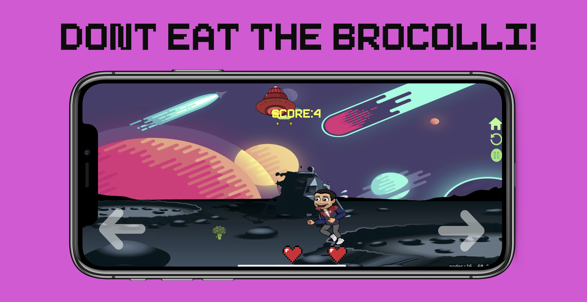

# Isaac's Pizza Planet
This iOS game is a 2-D game where the objective of the game is to eat as 
many slices of pizza as possible. You have only 3 lifes and if any slices 
drops on the floor, you lose a life. Additionally, if you accidently eat 
the brocolli you will lose imedietley. Each 20 slices you eat, you will 
gain an additional life as well.

  

## Technolgies Used
1. IDE: Xcode
2. Language: Swift
3. Libraries: SpriteKit, UIKit
4. StoryBoards and GameScenes

## Credits
1. Main Menu Music: Created by Kelly Yoshimura
Email: kellyyoshimura18@gmail.com
2. In Game Music: Created by Isaac Perez 
Email: iperez2435@gmail.com

